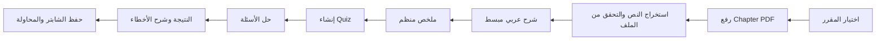
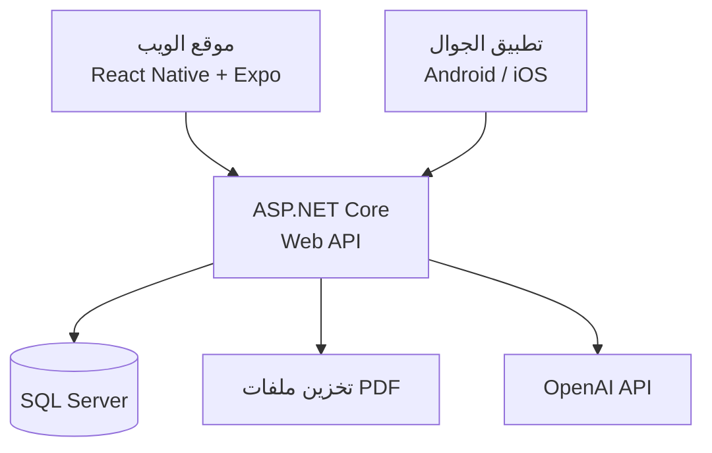
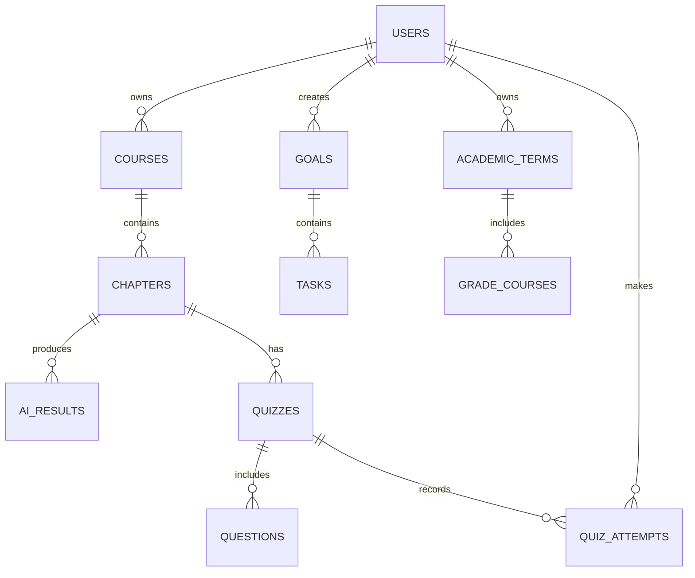

# StudyMate — رفيقك الدراسي الهادئ

> **حالة المشروع: في مرحلة التخطيط والتصميم.** لا توجد نسخة تشغيلية بعد، ولذلك لا يحتوي هذا المستودع حاليًا على تعليمات تشغيل أو لقطات من منتج مُنفَّذ.

<div dir="rtl">

## الفكرة

**StudyMate** منصة تعليمية موجهة لطلاب الجامعة، وبالأخص سياق طلاب جامعة حائل، تساعد الطالب على فهم الشابترات الإنجليزية، التدريب عليها، متابعة تقدمه الأكاديمي، وحساب معدله في مكان واحد.

ترتكز التجربة على البساطة والهدوء: معلومات كافية لاتخاذ الخطوة الدراسية التالية، دون واجهة مزدحمة أو نظام تحفيز طفولي.

## لماذا StudyMate؟

قد يجد الطالب نفسه متنقلًا بين ملفات المحاضرات، أدوات التلخيص، قوائم المهام، وحاسبات المعدل. يجمع StudyMate هذه الاحتياجات في رحلة واحدة مرتبطة بالمقرر والمحتوى الذي يدرسه الطالب.

## المزايا المخطط لها

| الميزة | الوصف | الحالة |
| --- | --- | --- |
| الحسابات الطلابية | تسجيل دخول وحساب مستقل لكل طالب | مخطط لها |
| المقررات والشابترات | إنشاء المقررات وإضافة الشابترات وحفظها | مخطط لها |
| رفع PDF | رفع شابتر وربطه بالمقرر مع حفظ بياناته | مخطط لها |
| شرح بالذكاء الاصطناعي | شرح عربي مبسط مع الإبقاء على المصطلحات الإنجليزية المهمة | مخطط لها |
| ملخص الشابتر | استخلاص أهم النقاط والتعريفات بصورة منظمة | مخطط لها |
| Quiz للمراجعة | أسئلة تدريبية مبنية على محتوى الشابتر | مخطط لها |
| مراجعة الأخطاء | نتيجة المحاولة مع تفسير مختصر للإجابات الخاطئة | مخطط لها |
| الأهداف والتقدم | أهداف، مهام اختيارية، إنجازات، ونسب تقدم | مخطط لها |
| حاسبة المعدل | حساب المعدل الفصلي والتراكمي من المواد والساعات والدرجات | مخطط لها |

## الأقسام الرئيسية

### 1) فهم المحتوى الدراسي

يختار الطالب مقررًا ويرفع **Chapter** بصيغة PDF. بعد معالجة المحتوى، تكون رحلته متسلسلة وواضحة:

```text
رفع الشابتر → شرح مبسط → ملخص → Quiz → النتيجة ومراجعة الأخطاء
```

- **الشرح:** بالعربية وبأسلوب مناسب للطالب، مع الحفاظ على المصطلحات الإنجليزية المهمة مثل `Inheritance` و`Standard Deviation`.
- **الملخص:** أهم الأفكار والتعريفات والنقاط التي تستحق المراجعة.
- **Quiz:** أسئلة تدريبية من محتوى الشابتر، مثل الاختيار من متعدد أو الأسئلة القصيرة.
- **النتيجة:** الدرجة والإجابة الصحيحة وشرح مختصر عند الخطأ.
- **الأرشيف:** يحتفظ الطالب بالشابترات ونتائج محاولاته للرجوع إليها لاحقًا.



### 2) متابعة التقدم والإنجاز

هذا القسم يعطي الطالب صورة هادئة عن رحلته الدراسية، دون اشتراط تسجيل يومي.

- إنشاء هدف دراسي وتحديد موعده أو مقياس إتمامه.
- إضافة مهام أو إنجازات عند الحاجة وربطها بمقرر أو هدف.
- معرفة نسبة التقدم وما تبقى من الهدف.
- عرض ملخص قصير للحالة الحالية: الأهداف النشطة، الإنجازات الأخيرة، والشابترات التي تمت مراجعتها.

### 3) حاسبة المعدل

قسم مستقل للمواد الأكاديمية:

- إدخال اسم ورمز المادة، عدد الساعات، والدرجة.
- تعديل وحذف المواد ضمن كل فصل دراسي.
- حساب المعدل الفصلي.
- إدخال المعدل التراكمي والساعات السابقة لحساب المعدل التراكمي الجديد.

> سلم تحويل الدرجات إلى نقاط سيكون **قابلًا للتهيئة**. يجب اعتماد سلم جامعة حائل الرسمي والتحقق منه قبل إطلاق الحاسبة للاستخدام الفعلي.

## تجربة الطالب

1. ينشئ الطالب حسابه ويضيف مقرراته لهذا الفصل.
2. يرفع شابترًا إلى المقرر ويقرأ الشرح والملخص الناتجين عنه.
3. يحل Quiz ويستخدم مراجعة الأخطاء لتحديد ما يحتاج إلى دراسة إضافية.
4. يضيف هدفًا أو مهمة مرتبطة بمقرر ويحدّث إنجازه عندما يناسبه.
5. يدخل درجات مواده ليعرض المعدل الفصلي والتراكمي المتوقعين.

## التقنية والمعمارية

| الطبقة | التقنية المخططة | مسؤوليتها |
| --- | --- | --- |
| الواجهات | React Native + Expo + TypeScript | تطبيق Android وiOS وموقع ويب متجاوب من منظومة واجهات مشتركة |
| التنقل | Expo Router | تنظيم الصفحات والمسارات عبر المنصات |
| الخلفية | ASP.NET Core Web API | الحسابات، قواعد العمل، رفع الملفات، والواجهات البرمجية |
| البيانات | SQL Server | التخزين العلاقي وعمليات CRUD |
| الذكاء الاصطناعي | OpenAI API | الشرح والملخص وإنشاء أسئلة الـQuiz من المحتوى |

تسمح واجهة [Responses API من OpenAI](https://developers.openai.com/api/reference/cli/resources/responses/methods/create) بتقديم مدخلات نصية أو ملفات وإنتاج مخرجات نصية أو JSON؛ سيبقى التكامل في **الخلفية فقط**، ولا تُضمَّن مفاتيح API في تطبيق الجوال أو موقع الويب.



## نموذج البيانات

ستحفظ قاعدة البيانات البيانات اللازمة لرحلة الطالب، مع ربط كل سجل بصاحب الحساب المناسب.

| الكيان | الغرض |
| --- | --- |
| `Users` | حسابات الطلاب وبياناتهم الأساسية |
| `Courses` | المقررات التابعة للطالب |
| `Chapters` | الشابترات وبيانات ملفات PDF والنص المستخرج |
| `AI_Results` | الشرح والملخص الناتجان عن الشابتر |
| `Quizzes` و`Questions` | الاختبارات والأسئلة والاختيارات والإجابات الصحيحة |
| `Quiz_Attempts` | إجابات الطالب ودرجات محاولاته |
| `Goals` و`Tasks` | الأهداف والمهام والإنجازات الدراسية |
| `Academic_Terms` و`Grade_Courses` | الفصول وموادها وساعاتها ودرجاتها لحساب المعدل |



## الخصوصية والأمان

- لا يرى الطالب إلا بياناته وملفاته ونتائجه.
- يطبّق الخادم التحقق من الصلاحيات عند الوصول إلى الملفات والسجلات.
- تُخزَّن مفاتيح OpenAI API وأي أسرار في إعدادات الخادم الآمنة فقط، وليس داخل تطبيق العميل أو المستودع.
- يُوضَّح للطالب أن إجابات الذكاء الاصطناعي مساعدة دراسية، وأن المرجع النهائي هو محتوى المقرر والمصادر الأكاديمية المعتمدة.

## خارطة الطريق

1. إنشاء مشروع الواجهات والخلفية وقاعدة البيانات، مع الحسابات والمقررات.
2. بناء واجهات الويب والجوال الأساسية بتصميم عربي RTL هادئ.
3. إضافة رفع PDF وحفظ الشابترات واستخراج النص.
4. ربط OpenAI API للشرح والملخص وإنشاء الـQuiz.
5. بناء صفحة الأهداف والمهام ولوحة التقدم.
6. بناء حاسبة المعدل وسلّم الدرجات القابل للتهيئة.
7. الاختبارات، مراجعة الأمان، ثم تجهيز النشر.

## تصاميم أولية للواجهة

ستضاف هنا التصاميم الأولية للواجهات الأربع التالية بعد تجهيز الأصول المرئية:

1. لوحة الطالب الرئيسية.
2. رحلة الشابتر: الشرح والملخص والـQuiz.
3. صفحة التقدم والأهداف والإنجازات.
4. حاسبة المعدل الفصلي والتراكمي.

## التشغيل والمساهمة

المشروع لا يزال في مرحلة التخطيط؛ ستُضاف تعليمات التثبيت والتشغيل والمساهمة بعد إنشاء تطبيق Expo وASP.NET Core Web API.

</div>
